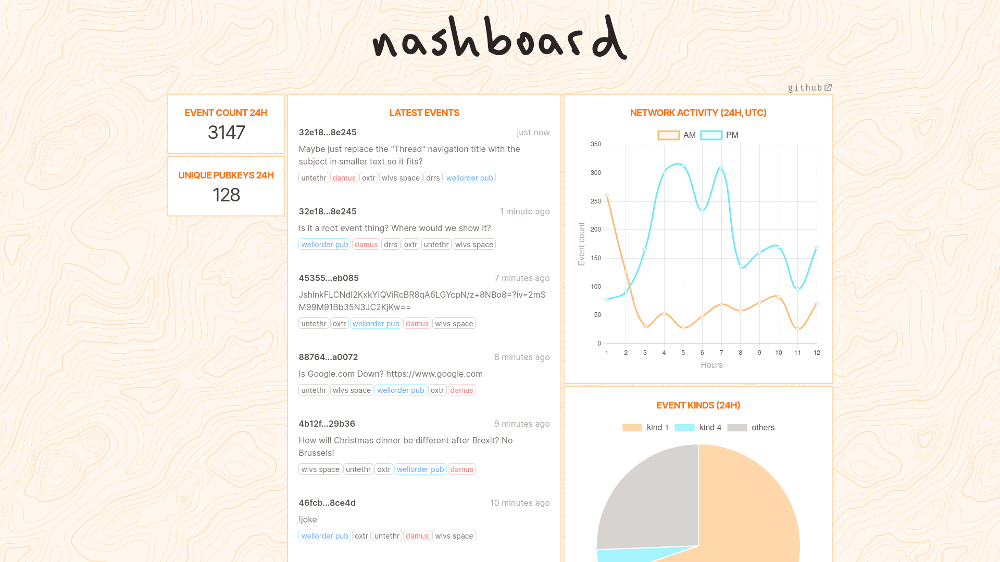

# Nashboard: a Nostr network dashboard

gm

Nostr, as described on its docs: "The simplest open protocol that is able to create a censorship-resistant global 'social' network once and for all." nashboard attemps to provide statistics of the entire Nostr network.

nashboard can be accessed at [https://nashboard.com](https://nashboard.com). For more information on Nostr: [https://github.com/nostr-protocol/nostr](https://github.com/nostr-protocol/nostr).

If you'd like to add your relay, add a line on `src/lib/relays.ts`, then submit a PR. Relay must have an alias. Alias is useful for for per-relay stats, which can be accessed at nashboard.com/${relayAlias}. Here's an example of per-relay stats: [nashboard.com/damus](https://nashboard.com/damus). It provides statistics of a single individual relay - in this case, the Damus relay - instead of the entire Nostr network.

The aliases include `wellorder`, `damus`, `minds`, `oxtr`, `wlvs.space`, and many more. To view stats of wellorder, head to [nashboard.com/wellorder](https://nashboard.com/wellorder), to view stats of wlvs.space, head to [nashboard.com/wlvs.space](https://nashboard.com/wlvs.space), to view stats of minds... you get the idea. To view all the aliases, check out `src/lib/relays.ts`.

